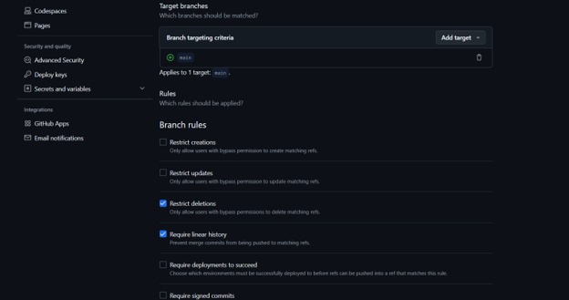
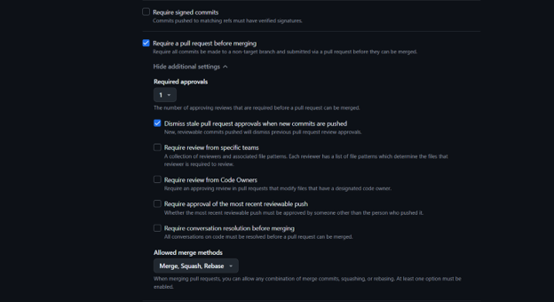
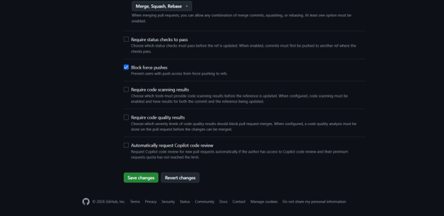
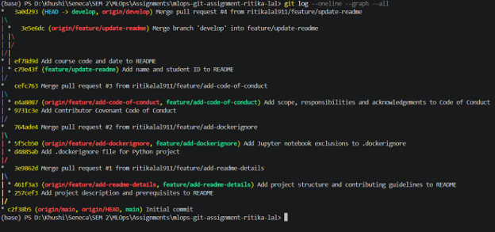

# Assignment 1 Report

**Student:** Ritika Lal
**Student ID:** 130865256
**Course:** MAI201 MLOps
**Date:** 2026-05-28

## 1. GitHub Network Graph

## 2. Branch Protection Rules

## 3. Git Log Output

## 4. Reflection on Merge Conflicts

Resolving the merge conflict was challenging because the same file was
edited on two different branches simultaneously. Understanding the conflict
markers (<<<<<<, =======, >>>>>>>) was confusing at first, but keeping
both changes and removing the markers resolved it successfully. The key
lesson was to carefully read what each side of the conflict contained
before deciding how to merge them, ensuring no changes were lost.
